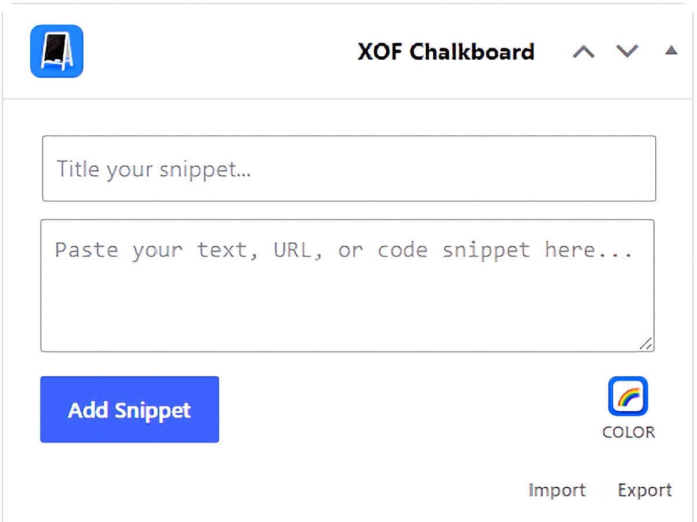
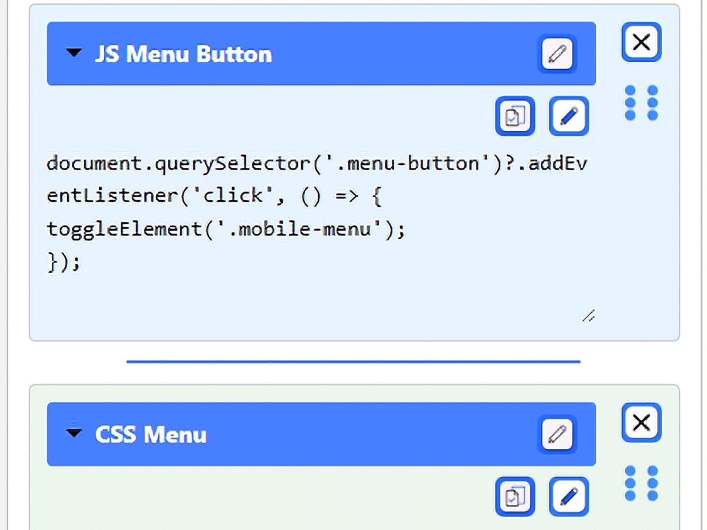
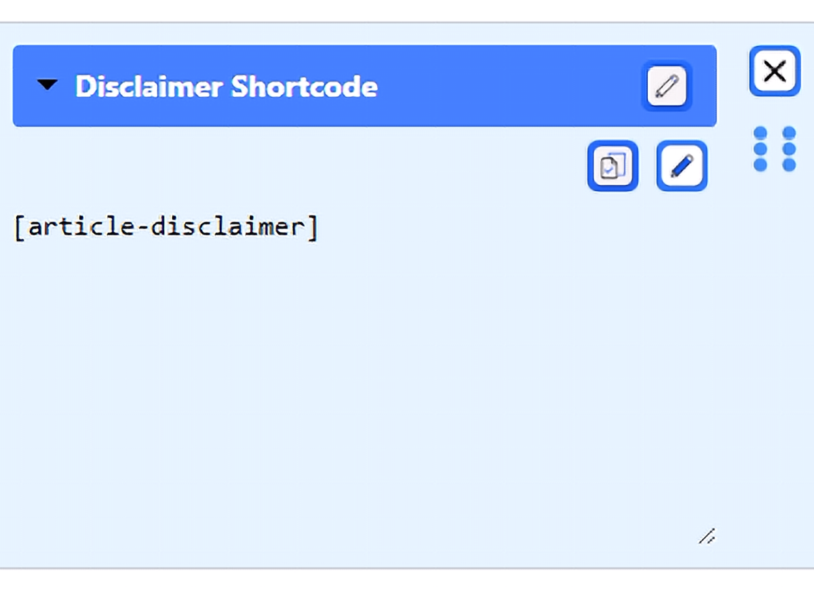
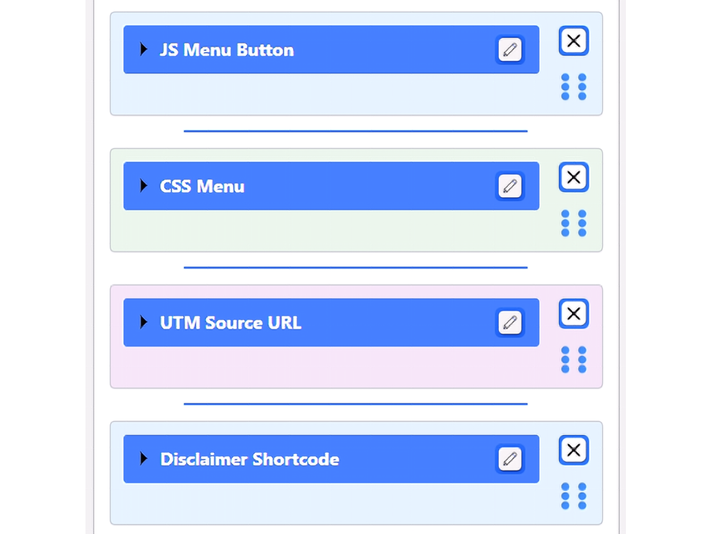

# XOF Admin Chalkboard

A clean, modular dashboard widget designed to help site administrators save, organize, and manage important text, URLs, and code snippets right from the WordPress dashboard.

## Features

* **Code-Safe Saving:** Safely store raw code snippets, plain text, and URLs without the system stripping out your HTML or PHP tags.
* **Drag-and-Drop Reordering:** Easily organize your snippets by clicking and dragging them into your preferred order.
* **Accordion UI:** Keep your dashboard clean by expanding only the snippets you need and collapsing the rest.
* **Resizable Workspace:** Easily drag the corner of any snippet to dynamically expand the viewing or editing area, giving you plenty of room to work with large code blocks.
* **Color Coding:** Assign specific colors to your snippets to visually categorize them at a glance.
* **One-Click Copy:** Click the clipboard icon to instantly copy your snippet to your device's clipboard.
* **Import/Export:** Export your entire chalkboard to a JSON file to easily migrate your snippets to another server or backup your data.

## Why I Built This

Like many tools built out of necessity, this plugin started with a simple problem in my daily workflow. Managing multiple sites across different Virtual Private Servers meant I was constantly reusing the same code snippets, reference notes, and administrative reminders across various environments. Jumping back and forth between server files, local note apps, and active site dashboards added friction to simple tasks.

To solve this, I wrote a small, lightweight snippet directly into a theme function so I could keep my notes right where I was already working:

```php
//! Sets up Admin Dashboard Widget for Notices (My First Code!)
add_action('wp_dashboard_setup', 'my_custom_dashboard_widgets');
function my_custom_dashboard_widgets() {
	global $wp_meta_boxes;
	wp_add_dashboard_widget('custom_notices_widget', 'LuvMyRecipe Theme Notices', 'custom_dashboard_notices');
}
function custom_dashboard_notices() {
	echo '<p>Admin Reminders!</p>';
}
```

Looking back, that early code was simple and tied directly to specific theme setups, but it worked. It put crucial information front and center in the WordPress admin area, saving time across every installation I maintained.

As my server footprint and project complexity grew, so did the need for a far more capable solution. Hardcoding notices into theme files or relying on heavy third-party plugins was inefficient. I needed a clean, native tool that allowed modular organization, quick updates, and intuitive drag-and-drop management without cluttering site code or slowing down the backend.

That simple notice widget evolved into this modular plugin. Built first to solve my own workflow bottlenecks across server environments, I realized other developers, site administrators, and agency owners face the exact same friction. This plugin is the result of turning a personal daily helper into a flexible, production-ready tool for the broader WordPress community.

## Screenshots


*A full overview of the dashboard widget in action, featuring the creation section, global import/export tools, and a stacked library of snippets.*


*The main XOF Chalkboard dashboard widget UI, highlighting the snippet creation tools and color picker.*


*An expanded JavaScript snippet demonstrating the action icons, drag-and-drop handle, and resizable workspace, with a collapsed CSS snippet stacked below.*


*Saving a URL for quick access. The expanded view reveals the snippet title, action controls, and adjustable text area.*


*Storing a frequently used WordPress shortcode. You can easily copy it to your clipboard directly from this expanded view.*


*A clean, collapsed view of multiple saved snippets, showcasing the color-coding and compact accordion UI.*

## Installation

**From your WordPress Dashboard:**
1. Download the latest `xof-admin-chalkboard.zip` release.
2. Navigate to 'Plugins' > 'Add New' in your WordPress admin menu.
3. Click 'Upload Plugin' at the top of the page.
4. Upload the zip file and click 'Install Now'.
5. Click 'Activate Plugin'.

**Manual Upload via FTP:**
1. Upload the unzipped `xof-admin-chalkboard` folder to the `/wp-content/plugins/` directory.
2. Activate the plugin through the 'Plugins' menu in WordPress.

## License
This project is licensed under the GPL-3.0+ License - see the LICENSE file for details.
